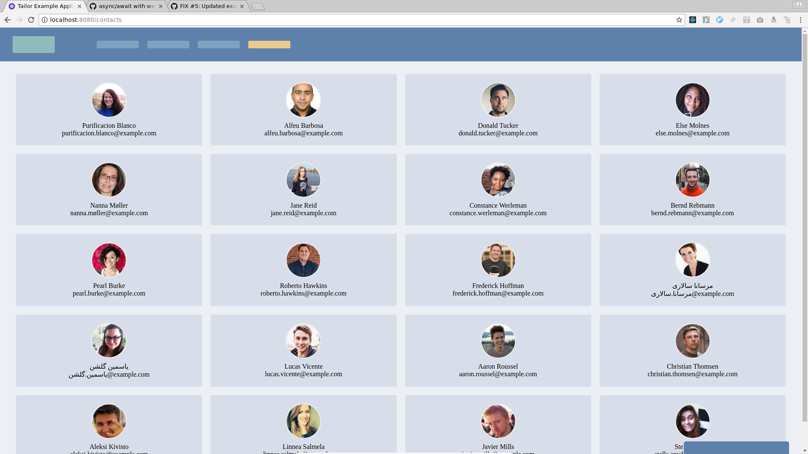

# Tailor React Single-Page Application

This repository is an example application using the [Mosaic frontend microservices architecture](https://mosaic9.org).

It makes use of [Tailor](https://github.com/zalando/tailor) only, so it is a pretty basic example.

Since the idea is that a separate team would be in charge of each of the fragments, there is some duplicate code within each of the fragments such as the Webpack configuration.

## How it works

Tailor is a layout service. It is able to parse HTML templates and replace `<fragment>` tags for their respective bundles.

Tailor also injects a RequireJS bundle to your template so you're able to use Webpack Externals to share dependencies across fragments (such as `react`).

## Fragments

Fragments are small applications.

They might be React applications, or any other implementation.

Fragments do not need to necessarily render something.

This app consists basically in a couple of fragments:

- fragment-common
- fragment-header
- fragment-contacts
- fragment-chat

Each fragment contains it's own `webpack.config.js` that specifies how to build it.

## Sharing dependencies with `fragment-common`

Fragments have several cross-dependencies that need to be shared:

- `react`
- `react-dom`
- `prop-types`
- `classnames`
- `proppy`
- `proppy-react`

In order to handle this, there is one fragment called `fragment-common`.

This is the fragment that exports common dependencies across fragments. It is the only one of the fragments who is actually built using `umd` as a `libraryTarget`.

This fragment is mostly necessary in order for you not to share `react` and other cross-fragment dependencies inside of each fragment bundle, making the bundle smaller for each fragment.

## `fragment-*`

All the other fragments are parts of this application.

Those shared dependencies are listed as externals in their respective webpack configurations.

All of them are built using `amd` as a `libraryTarget` in their Webpack configuration files.

The dependency management is handled with RequireJS on runtime.

## Setting up

1. Clone this repository using `git clone https://github.com/armand1m/mosaic-tailor-react-example.git`
1. Install all of the project dependencies with `yarn install`
1. Build the fragments with `yarn run build:fragments`

## Running

1. In one terminal, start the fragments servers with `yarn run start:fragments`
1. In another terminal, start the Tailor service with `yarn start`
1. Navigate to `http://localhost:8080`

## Running in development mode

1. In one terminal, start the fragments watchers with `yarn run watch:fragments`
1. In another terminal, start the fragments servers with `yarn run start:fragments`
1. In another terminal, start the Tailor service with `yarn start`
1. Navigate to `http://localhost:8080`

## Docker and build scripts

### Build Fragments

yarn run build:fragments
yarn run publish:fragments
nyarnpm run docker:build:fragments

### Build Tailor
yarn run publish
yarn run docker:build

### Start all services

`docker-compose up`

## References

- [Mosaic9](https://mosaic9.org)
- [Tailor Repository](https://github.com/zalando/tailor)
- [The Recipe For Scalable Frontends (Zalando)](https://www.youtube.com/watch?v=m32EdvitXy4)
- [Slides](https://www.slideshare.net/Codemotion/dan-persa-maximilian-fellner-the-recipe-for-scalable-frontends-codemotion-milan-2017)
